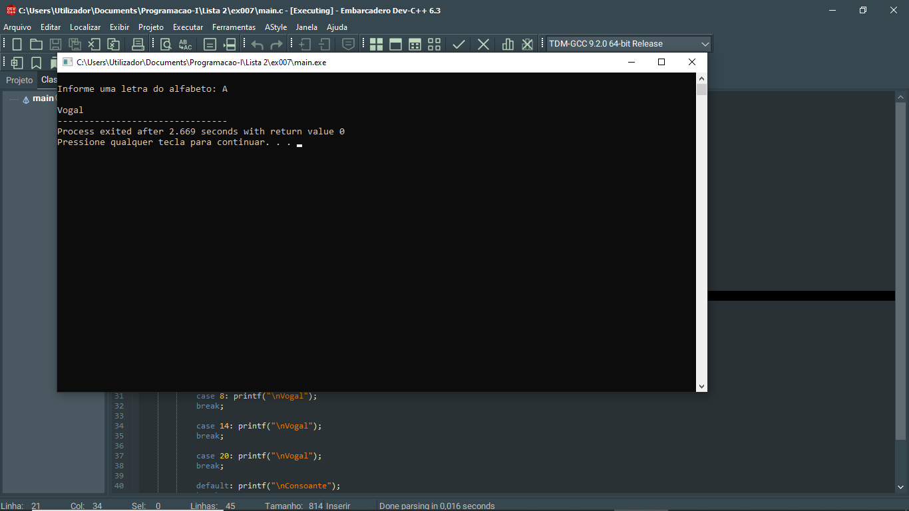

# 📘 Exercício 7

**Vogal ou Consoante**

Escreva um programa em C para verificar se um letra é uma vogal ou uma consoante.

---

## 🎯 Objetivos

- Praticar programação estruturada em C.

- Desenvolver algoritmos utilizando estruturas condicionais.

- Aplicar estruturas de repetição (for, while e do...while).

- Trabalhar com operações matemáticas e lógica computacional.

- Resolver problemas envolvendo números, sequências e caracteres.

- Melhorar a capacidade de análise e implementação de algoritmos.

---

## 🛠️ Tecnologias Utilizadas

- Linguagem C

- Biblioteca padrão da linguagem C (stdio.h, stdlib.h, math.h, ctype.h, time.h, entre outras quando necessário).

- Embarcadero Dev-C++

- Visual Studio Code
---

## 📂 Estrutura do Projeto

```
ex007/ 
├── README.md 
└── main.c 
```
---

## 💻 Saída esperada

 

---

## 📚 Conteúdos Praticados

- Entrada e saída de dados (scanf e printf)

- Estruturas condicionais (if, if...else e switch)

- Estruturas de repetição (for, while e do...while)

- Contadores e acumuladores

- Validação de entradas

- Operadores aritméticos, relacionais e lógicos

- Funções matemáticas (math.h)