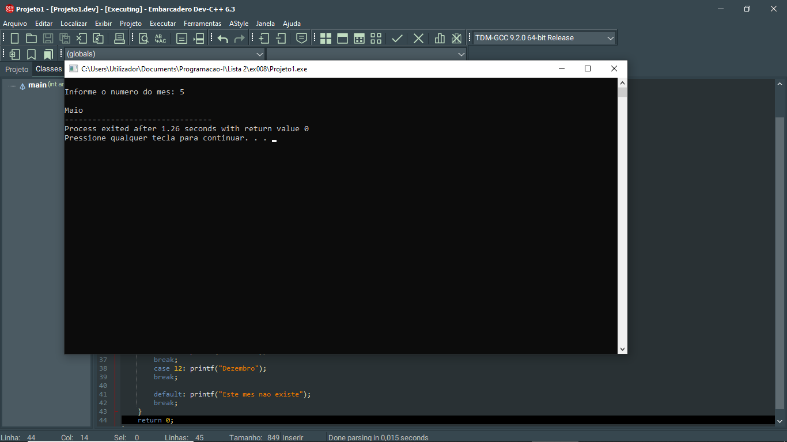

# 📘 Exercício 8

**Nome do mês correspondente**

Escreva um programa em C para ler o número do mês e imprime o nome do mês correspondente.

---

## 📂 Estrutura do Projeto

```
ex008/ 
├── README.md 
└── main.c 
```
---

## 💻 Saída esperada

 

---

## 📚 Conteúdos Praticados

- Entrada e saída de dados (scanf e printf)

- Estruturas condicional (switch)