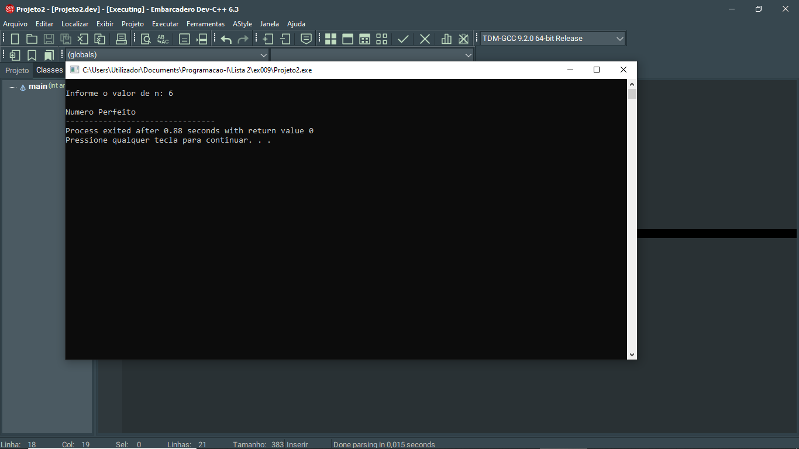

# 📘 Exercício 9

**Número perfeito**

Escreva um programa em C que leia um número inteiro positivo n e imprima todos os números
perfeitos menores que n.

Dica: Um número é perfeito se a soma de seus divisores próprios (excluindo ele mesmo) é igual a ele.

---

## 📂 Estrutura do Projeto

```
ex009/ 
├── README.md 
└── main.c 
```
---

## 💻 Saída esperada

 

---

## 📚 Conteúdos Praticados

- Entrada e saída de dados (scanf e printf)

- Estruturas condicional (if)

- Estruturas de repetição (for)