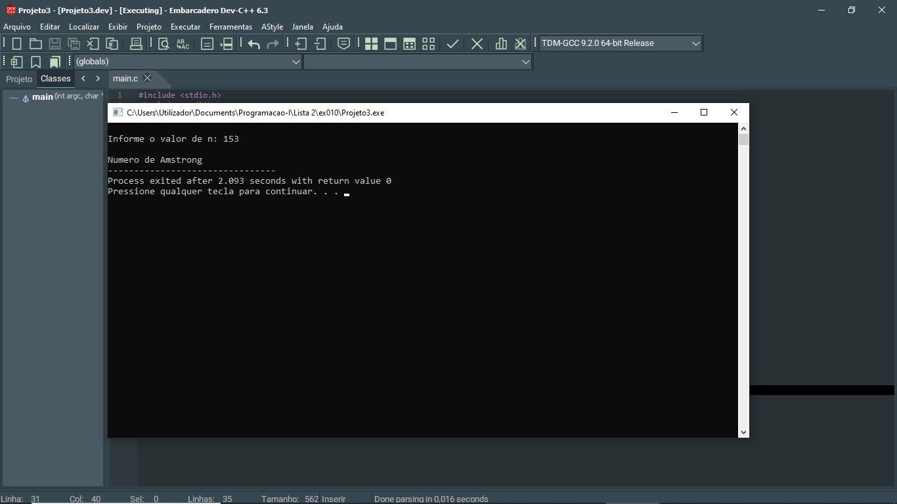

# 📘 Exercício 10

**Número de Armstrong**

Implemente um programa que leia um número inteiro n e verifique se ele é um número de
Armstrong. Um número de Armstrong é aquele que é igual à soma de seus dígitos elevados à
quantidade de dígitos. 

Exemplo: 153 = 13 + 53 + 33
.

---

## 📂 Estrutura do Projeto

```
ex010/ 
├── README.md 
└── main.c 
```
---

## 💻 Saída esperada

 

---

## 📚 Conteúdos Praticados

- Entrada e saída de dados (scanf e printf)

- Estruturas condicional (if)

- Estruturas de repetição (while)

- Biblioteca math.h - função pow