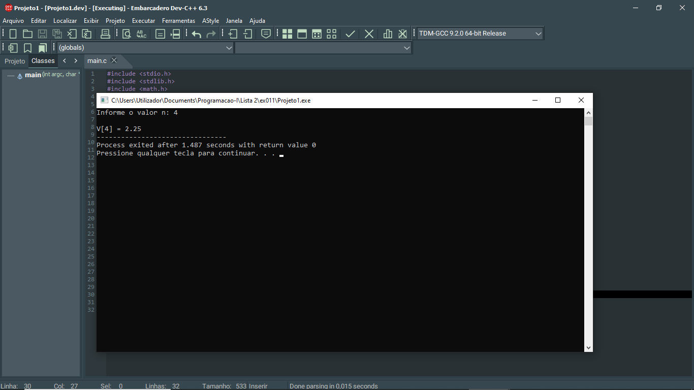

# 📘 Exercício 11

**N-ésimo termo da sequência**

Escreva um programa que calcule o n-ésimo termo da sequência definida por:

U0 = 1

U1 = 2

Un = Un−2 + ((−1) <sup>n</sup> ) / n

---

## 📂 Estrutura do Projeto

```
ex011/ 
├── README.md 
└── main.c 
```
---

## 💻 Saída esperada

 

---

## 📚 Conteúdos Praticados

- Entrada e saída de dados (scanf e printf)

- Estruturas condicional (if)

- Estruturas de repetição (for)

- Biblioteca math.h - função pow