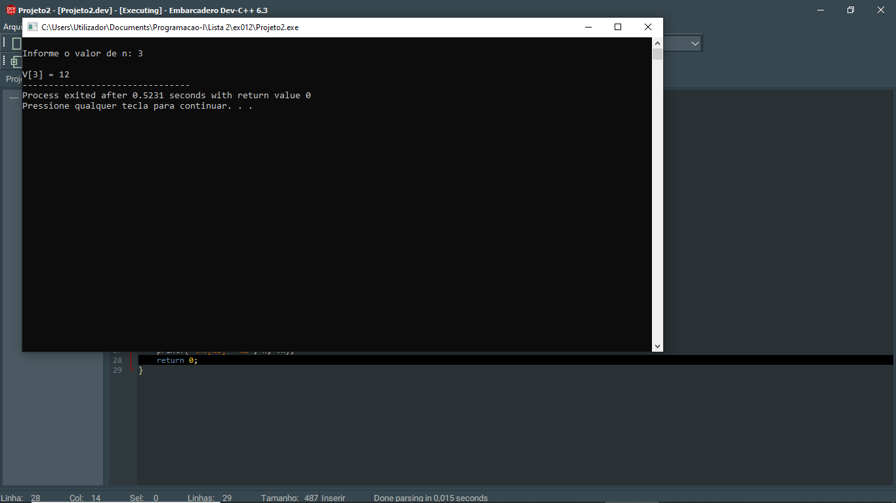

# 📘 Exercício 12

**N primeiros termos**

Dado uma série Vn definida por :


V0 = 2

Vn = Vn−1 + 2, se n par

Vn = Vn−1 + 4, se n impar

---

## 📂 Estrutura do Projeto

```
ex012/ 
├── README.md 
└── main.c 
```
---

## 💻 Saída esperada

 

---

## 📚 Conteúdos Praticados

- Entrada e saída de dados (scanf e printf)

- Estruturas condicional (if)

- Estruturas de repetição (for)