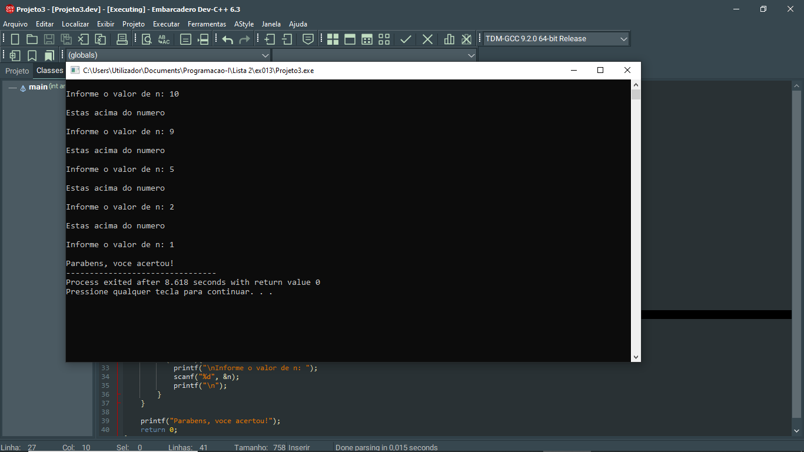

# 📘 Exercício 13

**Número mágico**

Escreva um programa em C que defina um número mágico (gerado aleatóriamente) e leia números inteiros introduzidos pelo utilizador até que este adivinhe esse número. 

Indique-lhe sempre
se o número introduzido está acima ou abaixo do número mágico.

---

## 📂 Estrutura do Projeto

```
ex013/ 
├── README.md 
└── main.c 
```
---

## 💻 Saída esperada

 

---

## 📚 Conteúdos Praticados

- Entrada e saída de dados (scanf e printf)

- Estruturas condicional (if)

- Estruturas de repetição (while)

- Bibliotecas (time.h, stdbool.h)

- Variáveis booleanas