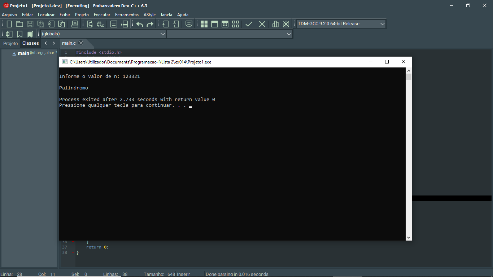

# 📘 Exercício 14

**Número palíndromo**

Escreva um programa em C que implemente um programa para verificar se um número dado é
um palíndromo usando um loop while. 

Um número é palíndromo se pode ser lido de trás para frente do mesmo jeito.


---

## 📂 Estrutura do Projeto

```
ex014/ 
├── README.md 
└── main.c 
```
---

## 💻 Saída esperada

 

---

## 📚 Conteúdos Praticados

- Entrada e saída de dados (scanf e printf)

- Estruturas condicional (if)

- Estruturas de repetição (while)

- Biblioteca (math.h)