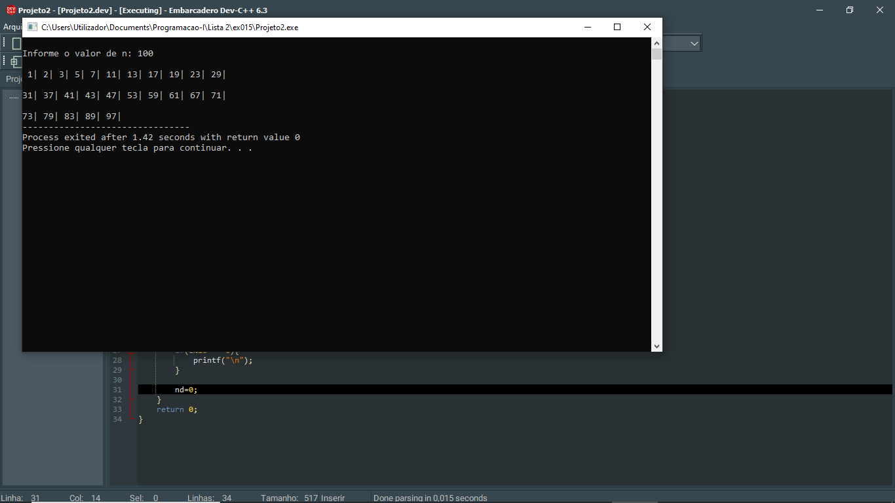

# 📘 Exercício 15

**Números primos**

Escreva um programa em linguagem C que leia um número inteiro positivo N, introduzido pelo
utilizador.

O programa deve determinar e apresentar todos os números primos no intervalo de 1 até N.

---

## 📂 Estrutura do Projeto

```
ex015/ 
├── README.md 
└── main.c 
```
---

## 💻 Saída esperada

 

---

## 📚 Conteúdos Praticados

- Entrada e saída de dados (scanf e printf)

- Estruturas condicional (if)

- Estruturas de repetição (for)