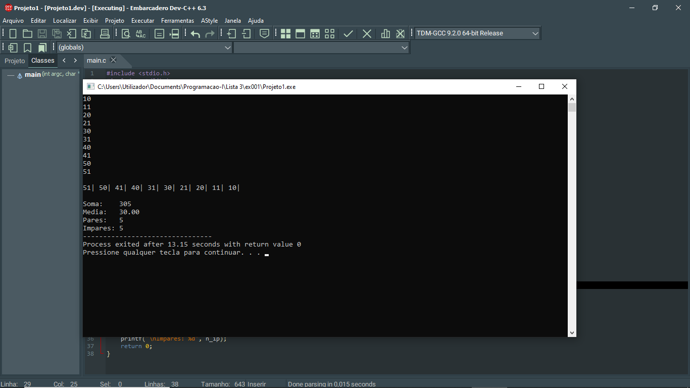

# 📘 Exercício 1

**Soma, Média, Quantidade de pares e ímpares**

Crie um programa que leia 10 números inteiros e imprima o vetor na ordem inversa. De seguida
calcule, a soma, a média e informe quantos elementos são pares e ímpares.

---

## 📂 Estrutura do Projeto

```
ex001/ 
├── README.md 
└── main.c 
```
---

## 💻 Saída esperada

 

---

## 📚 Conteúdos Praticados

- Estrutura de repetição (for) 

- Vetores 

- Estatísticas em Vetores 