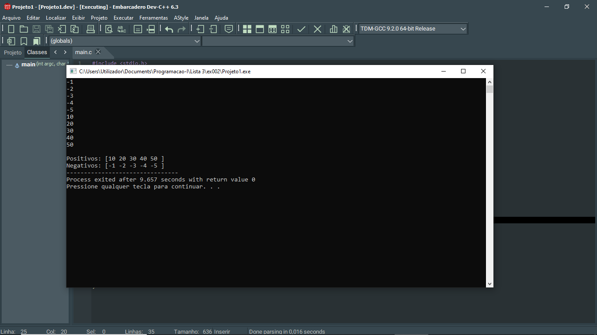
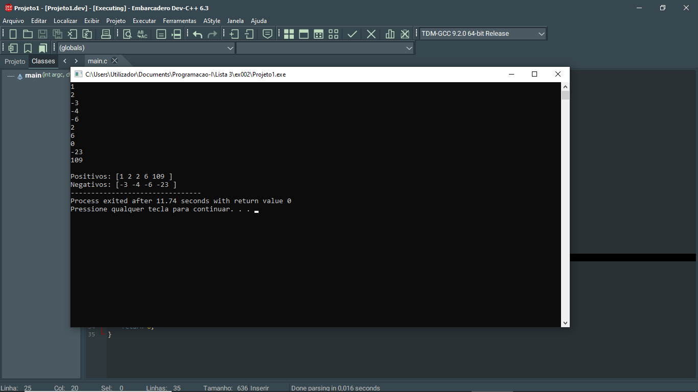

# 📘 Exercício 2

**Valores positivos e negativos**

Escrever um programa que pega a dimensão N = 10 de um array de int preenche o array com
valores digitados e o imprima. Em seguida, copie todos os componentes estritamente positivos em uma segunda matriz Tpos e todos os valores estritamente negativos em uma matriz Tneg.
Imprimir Tpos e Tneg

---

## 📂 Estrutura do Projeto

```
ex002/ 
├── README.md 
└── main.c 
```
---

## 💻 Saída esperada

 
 <br>
 

---

## 📚 Conteúdos Praticados

- Estrutura de repetição (for) 

- Vetores 

- Estatísticas em Vetores 