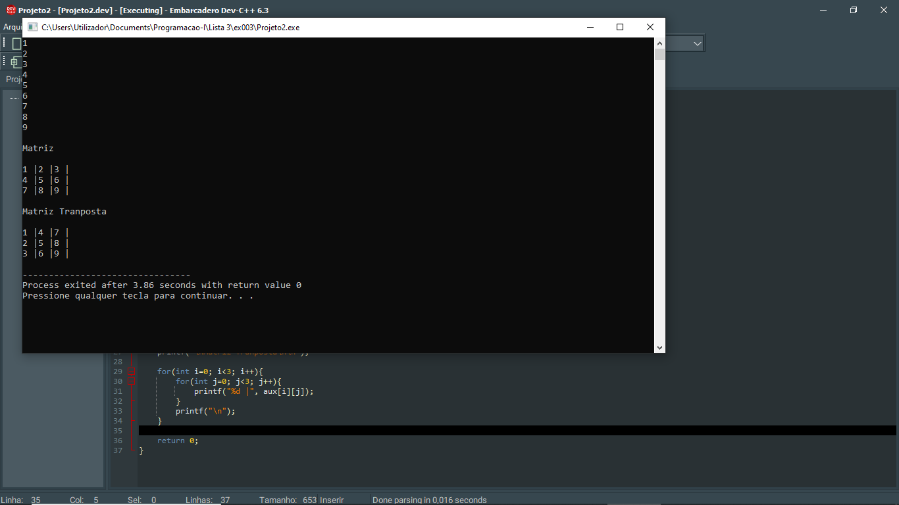

# 📘 Exercício 2

**Matriz Transposta**

Crie uma matriz 3x3 e gere sua matriz transposta

---

## 📂 Estrutura do Projeto

```
ex003/ 
├── README.md 
└── main.c 
```
---

## 💻 Saída esperada

 

---

## 📚 Conteúdos Praticados

- Estrutura de repetição (for) 

- Matrizes 

- Permutação de elementos