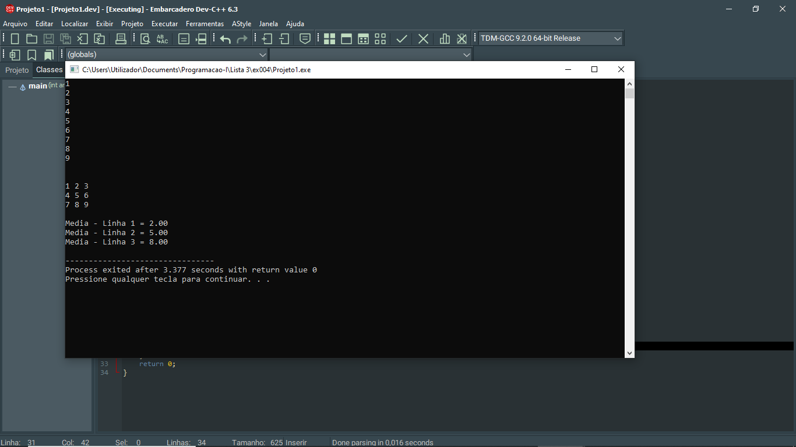

# 📘 Exercício 4

**Média de cada linha**

Calcule a média dos elementos para cada linha de uma matriz

---

## 📂 Estrutura do Projeto

```
ex004/ 
├── README.md 
└── main.c 
```
---

## 💻 Saída esperada

 

---

## 📚 Conteúdos Praticados

- Estrutura de repetição (for) 

- Matrizes 

- Estatísticas da matriz