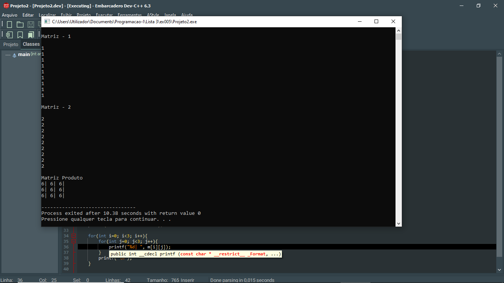

# 📘 Exercício 5

**Multiplicação de 2 matrizes**

Escreva um programa que realize o produto de duas matrizes quadradas de mesma dimensão.

---

## 📂 Estrutura do Projeto

```
ex005/ 
├── README.md 
└── main.c 
```
---

## 💻 Saída esperada

 

---

## 📚 Conteúdos Praticados

- Estrutura de repetição (for) 

- Matrizes 

- Produto Matricial