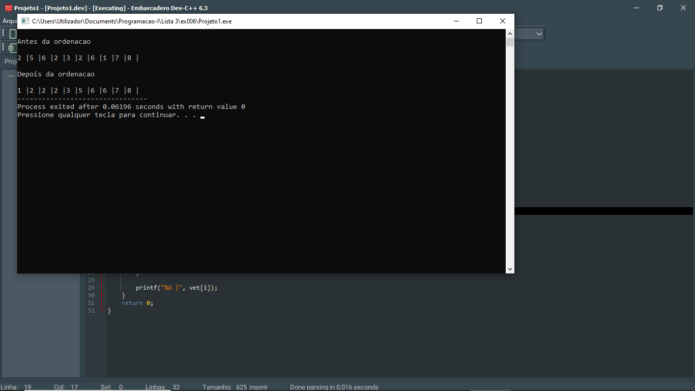
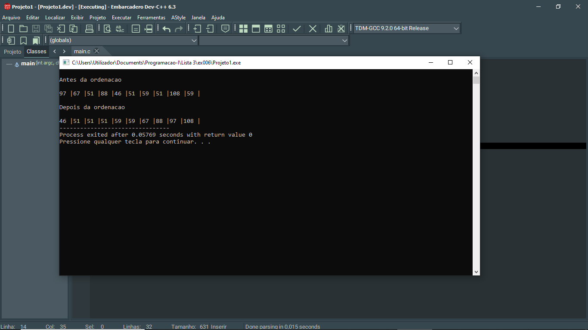

# 📘 Exercício 6

**Ordenação por seleção (Selection Sort)**

Escrever um algoritmo para ordenar um vetor de números inteiros por ordem crescente utilizando a Ordenação por seleção (Selection Sort) : Esta ordenação consiste em colocar cada
elemento da matriz na sua posição definitiva, do mais pequeno para o maior:

1. Selecionar a primeira posição do vetor.

2. Assumir que o elemento da posição atual é o menor.

3. Comparar esse elemento com todos os elementos à direita.

4. Se encontrar um elemento menor: atualizar a posição do menor elemento.

5. Após terminar as comparações: trocar o menor elemento encontrado com o elemento da
posição atual.

6. Avançar para a próxima posição do vetor.

7. Repetir o processo até o penúltimo elemento.


---

## 📂 Estrutura do Projeto

```
ex006/ 
├── README.md 
└── main.c 
```
---

## 💻 Saída esperada

 
 <br>
 

---

## 📚 Conteúdos Praticados

- Estrutura de repetição (for) 

- Vetores 

- Biblioteca time.h - para gerar valores aleatórios.