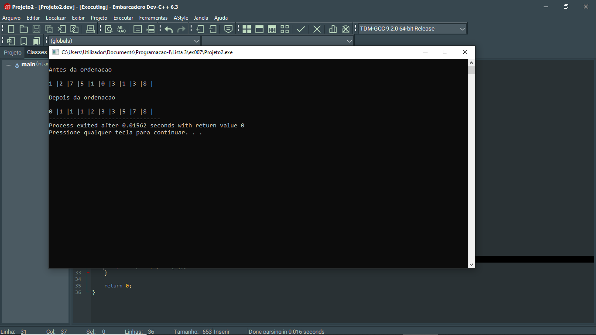
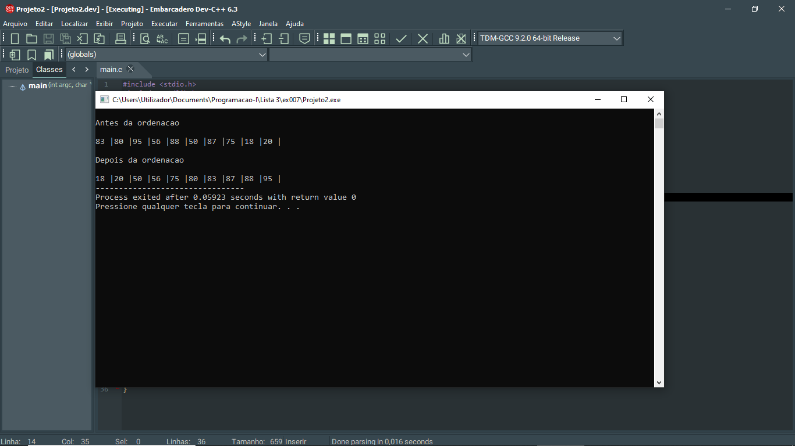

# 📘 Exercício 7

**Ordenação por inserção (Insertion Sort)**

Escrever um algoritmo para ordenar um vetor de números inteiros por ordem crescente utilizando a Ordenação por inserção (Insertion Sort): 

Esta ordenação consiste em construir a
sequência ordenada passo a passo, inserindo cada elemento na sua posição correta, do mais
pequeno para o maior:

1. Considerar o primeiro elemento como já ordenado.

2. Selecionar o próximo elemento do vetor.
3. Guardar o valor do elemento selecionado.
4. Comparar o elemento guardado com os elementos anteriores.
5. Enquanto o elemento anterior for maior: mover o elemento anterior uma posição à direita.
6. Inserir o elemento guardado na posição correta.
7. Avançar para o próximo elemento do vetor.
8. Repetir o processo até o último elemento.


---

## 📂 Estrutura do Projeto

```
ex007/ 
├── README.md 
└── main.c 
```
---

## 💻 Saída esperada

 
 <br>
 

---

## 📚 Conteúdos Praticados

- Estrutura de repetição (for) 

- Vetores 

- Biblioteca time.h - para gerar valores aleatórios.