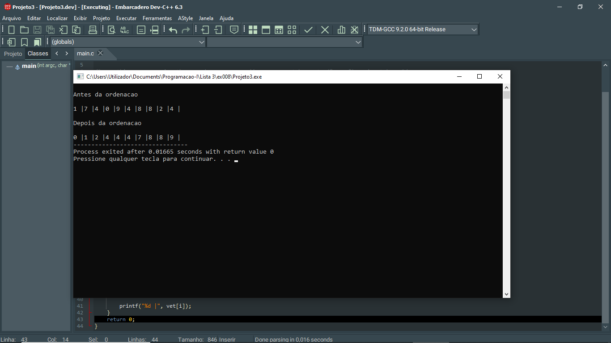
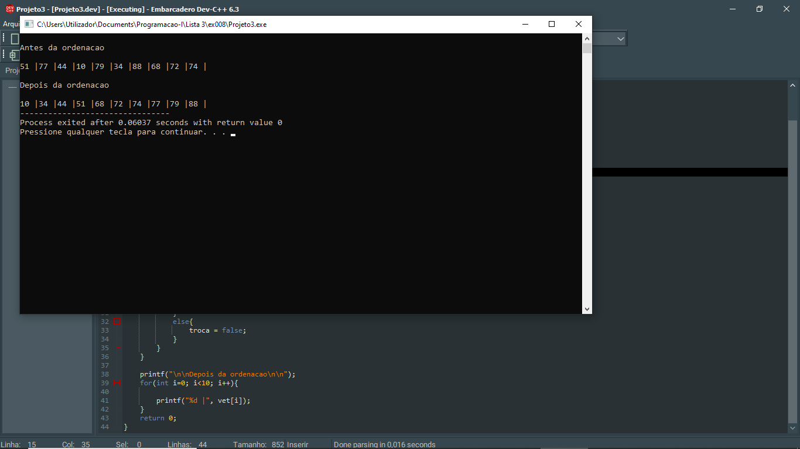

# 📘 Exercício 8

**Ordenação por Combo (Comb Sort)**

Escrever um algoritmo para ordenar um vetor de números inteiros por ordem crescente utilizzando a Ordenação por Combo (Comb Sort): Esta ordenação consiste em construir a sequência ordenada passo a passo, inserindo cada elemento na sua posição correta, do mais pequeno
para o maior:

1. Definir o intervalo inicial com o tamanho do vector

2. Definir a constante de redução: factor de redução 


---

## 📂 Estrutura do Projeto

```
ex008/ 
├── README.md 
└── main.c 
```
---

## 💻 Saída esperada

 
 <br>
 

---

## 📚 Conteúdos Praticados

- Estrutura de repetição (for) 

- Vetores 

- Variáveis booleanas 

- Biblioteca time.h - para gerar valores aleatórios.

- Biblioteca stdbool.h