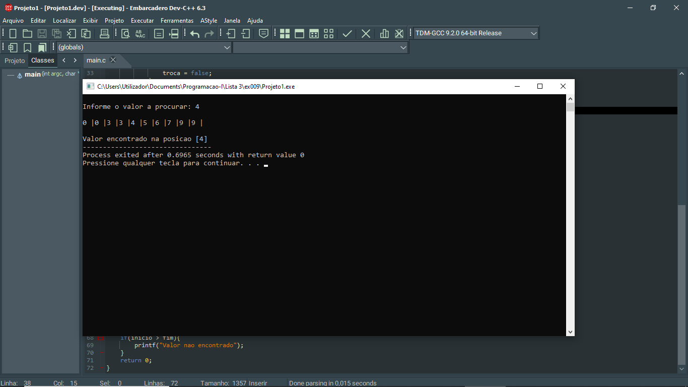
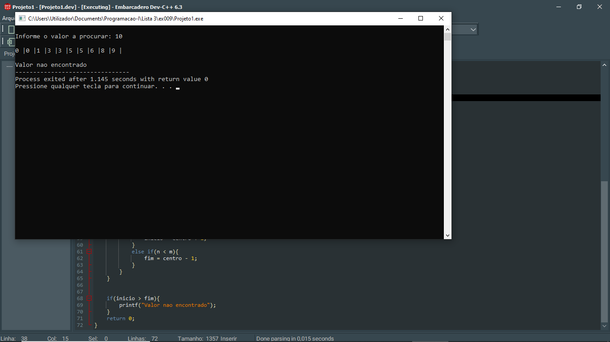

# 📘 Exercício 9

**Pesquisa Dicotómica**

Dada um vector ordenada de números reais, escreva um programa que procure um elemento
na matriz usando os seguintes métodos: de pesquisa dicotômica.

- O método de pesquisa sequencial (ou linear) <br> consiste em comparar o valor procurado
com todos os valores presentes na tabela.

- O método de pesquisa dicotômica consiste em:

1. Determinar m, elemento na posição central do array;

2. Se este for o valor desejado, paramos com sucesso;
3. Caso contrário, dois casos são possíveis:
(a) Se m for maior que o valor procurado, já que o array está ordenado, significa
que é suficiente continuar a busca na primeira metade do array;
(b) Caso contrário, basta pesquisar a metade direita.
4. Repetimos isso até encontrar o valor pesquisado ou reduza o intervalo de pesquisa
para um intervalo vazio, o que significa que o valor pesquisado não está presente

---

## 📂 Estrutura do Projeto

```
ex009/ 
├── README.md 
└── main.c 
```
---

## 💻 Saída esperada

 
 <br>
 

---

## 📚 Conteúdos Praticados

- Estrutura de repetição (for) 

- Vetores 

- Biblioteca time.h - para gerar valores aleatórios.