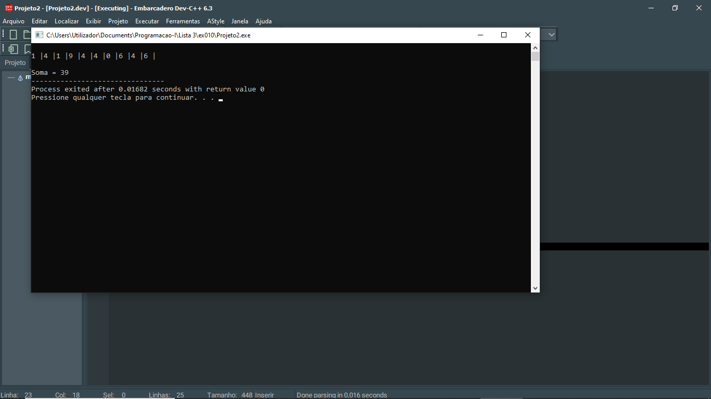

# 📘 Exercício 10

**Soma de valores do array**

Escreva um programa em C que preencha um vector de inteiros e calcule a soma de seus elementos usando um ponteiro para sua varredura.

---

## 📂 Estrutura do Projeto

```
ex010/ 
├── README.md 
└── main.c 
```
---

## 💻 Saída esperada

 

---

## 📚 Conteúdos Praticados

- Estrutura de repetição (for) 

- Vetores 

- Biblioteca time.h - para gerar valores aleatórios.