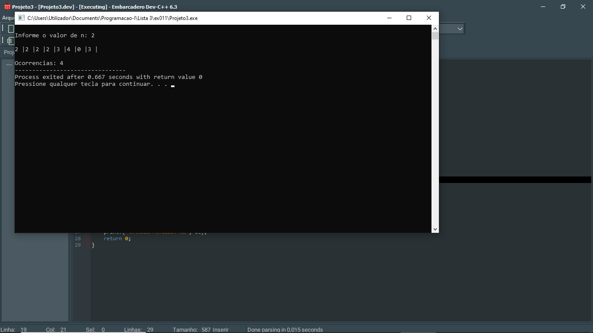
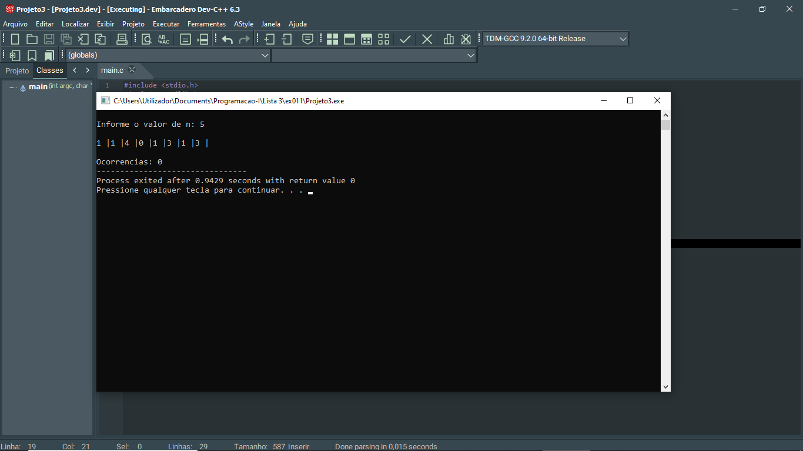

# 📘 Exercício 11

**Ocorrência de uma valor**

Escreva um programa que, dado um array de inteiros já inicializado, pergunte ao usuário qual inteiro procurar e então imprima o número de ocorrências desse inteiro no array.

- Declare o array com [].

- Use ponteiros para aceder os elementos do array, ou seja, sem usar uma variável de índice.

---

## 📂 Estrutura do Projeto

```
ex011/ 
├── README.md 
└── main.c 
```
---

## 💻 Saída esperada

 
 <br>
 

---

## 📚 Conteúdos Praticados

- Estrutura de repetição (for) 

- Vetores 

- Biblioteca time.h - para gerar valores aleatórios.