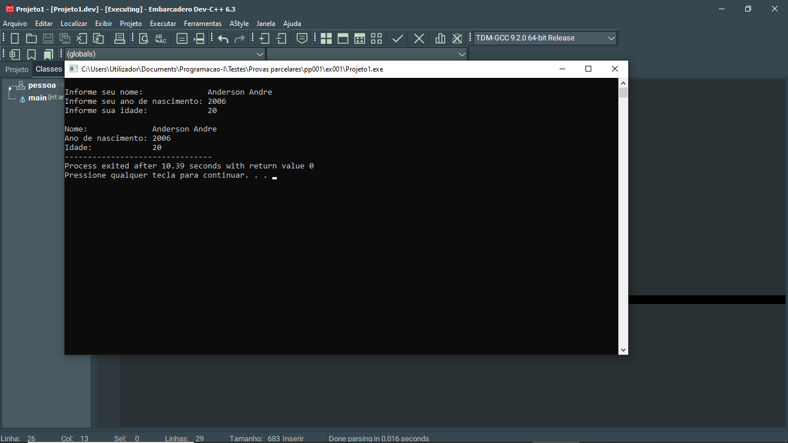

# 📘 Exercício 1

**Dados por estrutura**

Fazer um programa que armazena três dados sobre si.

Usar estrutura.

---

## 📂 Estrutura do Projeto

```
ex001/ 
├── README.md 
└── main.c 
```
---

## 💻 Saída esperada

 

---

## 📚 Conteúdos Praticados

- Bibliotecas padrão do C

- Struct