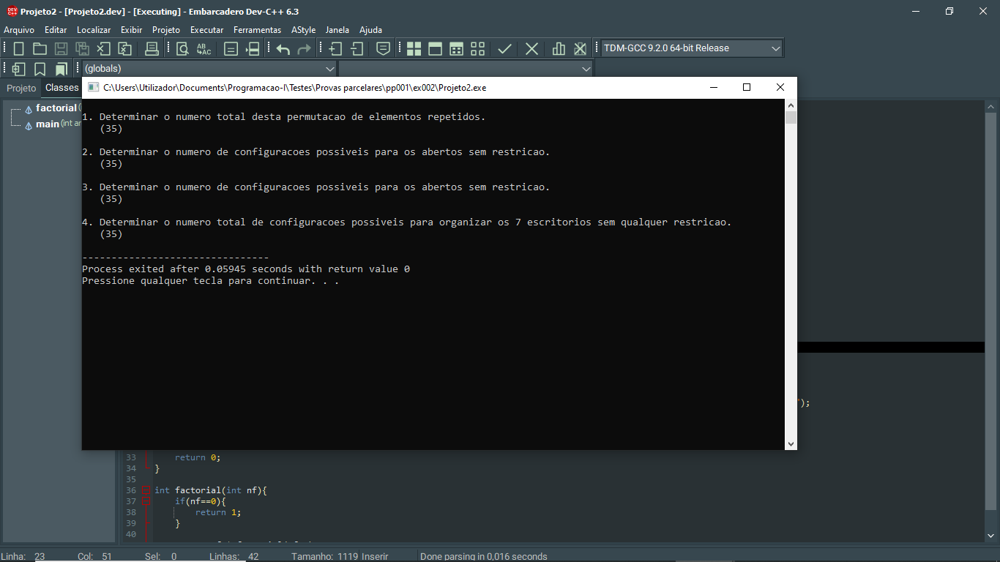

# 📘 Exercício 2

Usando a sua capacidade de análise, reflexão, reformulação e de exclusão segue:

No SPACIUM do ISPTEC existe uma fila linear de 7 escritórios (numeros de 1 à 7), cada escritório pode estar aberto (A) ou fechado (F), considerando apenas configurações com exatamente 3 escritórios abertos e 4 fechados, faça um programa em C para:

1. Determinar o número total desta permutação de elementos repetidos.

2. Determinar o número de configurações  possíveis para os abertos sem restrição.

3. Determinar o número de configurações  possíveis para os fechados sem restrição.

4. Determinar o número total de configurações possíveis para organizar os 7 escritórios sem qualquer restrição.
---
## 🛠️ Método de Resolução

1. ```Permutação com repetição (n=7, k=3, j=4)```
    <br> P<sub>n</sub> = n! / (k! * j!)

2. ```Combinação (n=7, p=3)```
    <br> P<sub>n,p</sub> = n! / p! * (n-p)!

3. ```Combinação (n=7, p=4)```
    <br> P<sub>n,p</sub> = n! / p! * (n-p)!

4. ```Combinação (n=7, p=4 ou p=3)```
    <br> P<sub>n,p</sub> = n! / p! * (n-p)!

**Recomendações**: estudar um pouco mais sobre análise combinatória.

---
## 📂 Estrutura do Projeto

```
ex002/ 
├── README.md 
└── main.c 
```
---

## 💻 Saída esperada

 

---

## 📚 Conteúdos Praticados

- Bibliotecas padrão do C

- Funções

- Cálculo do factorial

**Análise combinatória**

- Fórmula de combinação

- Fórmula de permutação com repetição