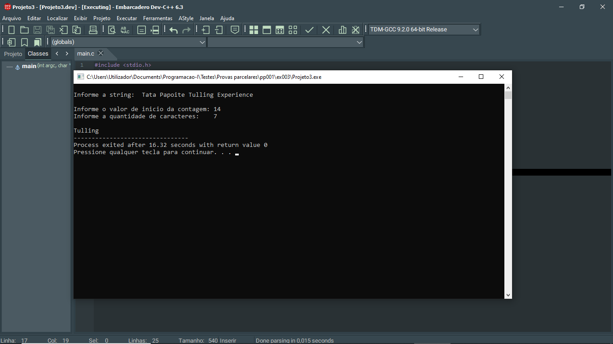

# 📘 Exercício 3

**String inside**

Dada uma string o valor de inicio da contagem e a quantidade de caracteres que serão contados. Fazer umn programa que apresente os caracteres contados.

**Entrada**

String: <u>Tata Papoite **Tulling** Experience </u> 
<br>
Valor de ínicio da contagem: 14 
<br>
Quantidade de caracteres a serem contados: 7 

**Saída** 

Tulling

---

## 📂 Estrutura do Projeto

```
ex003/ 
├── README.md 
└── main.c 
```
---

## 💻 Saída esperada

 

---

## 📚 Conteúdos Praticados

- Bibliotecas padrão do C

- Manipulação de strings

- Estrutura de repetição for