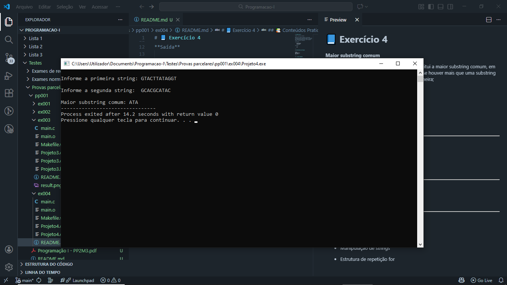

# 📘 Exercício 4

Dadas duas strings, devolve a string que constitui a maior substring comum, em posições correspondentes entre duas strings: se houver mais que uma substring com o com o tamanho máximo, retorna a primeira;

**Entrada**
    
    GTACTTATAGGT
    GCACGCATAC

**Saída** 

    ATA

---

## 📂 Estrutura do Projeto

```
ex004/ 
├── README.md 
└── main.c 
```
---

## 💻 Saída esperada

 

---

## 📚 Conteúdos Praticados

- Bibliotecas padrão do C

- Biblioteca string.h(strlen, strcpy)

- Manipulação de strings

- Estrutura de repetição for