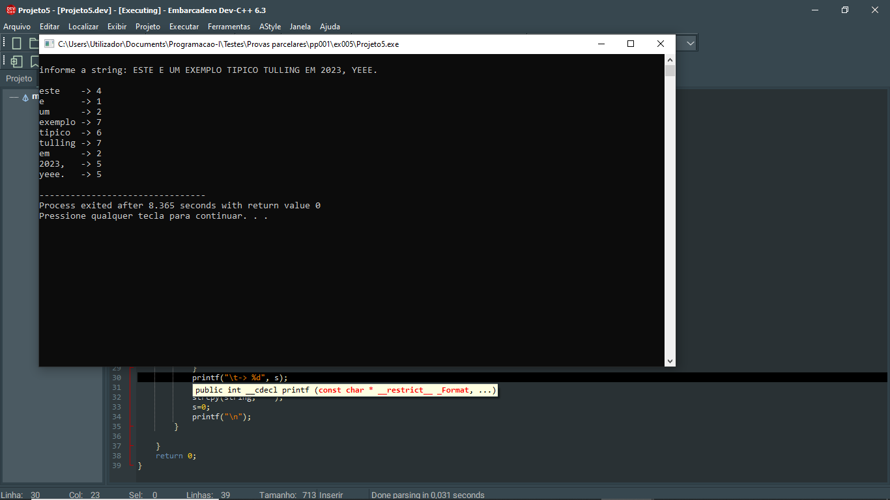

# 📘 Exercício 5

**Maior substring comum**

Dada uma string (frase), fazer um programa que apresente todas as palavras em minúsculas (as considere separadas por espaço) e o tamanho de cada palavra.

**Entrada**
    
    ESTE É UM EXEMPLO TIPÍCO TULLING EM 2023, YEEE.

**Saída** 

    este    -> 4
    é       -> 1
    um      -> 2
    exemplo -> 7
    tipíco  -> 6
    tulling -> 7
    em      -> 2
    2023,   -> 5
    yeee.   -> 5

---

## 📂 Estrutura do Projeto

```
ex006/ 
├── README.md 
└── main.c 
```
---

## 💻 Saída esperada

 

---

## 📚 Conteúdos Praticados

- Bibliotecas padrão do C

- Biblioteca string.h (strlen, strcpy)

- Biblioteca ctype.h (tolower)

- Manipulação de strings

- Estrutura de repetição for