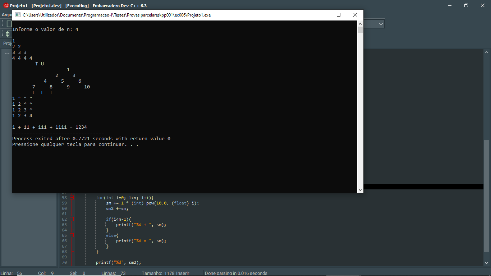
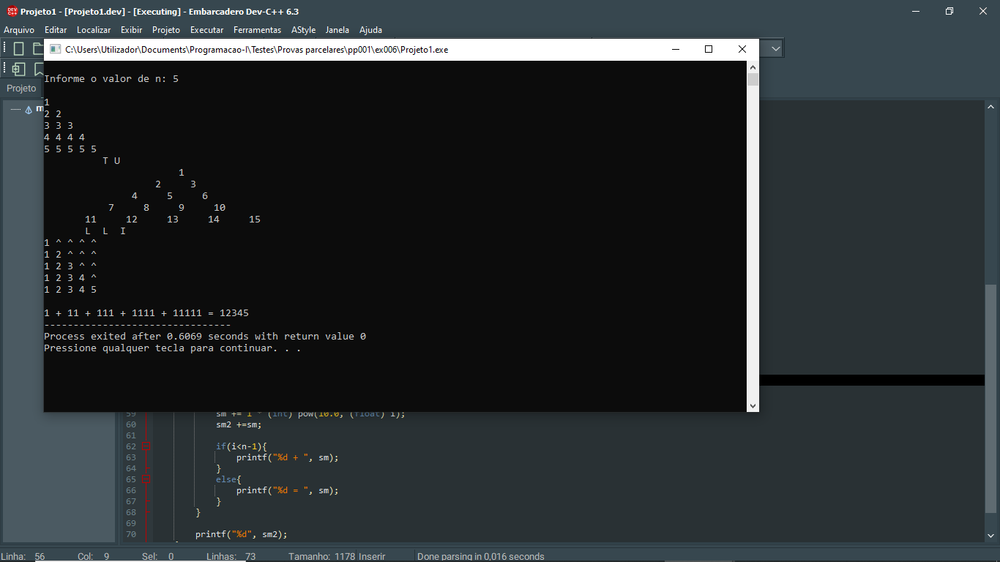

# 📘 Exercício 6

**TULLINGTREE**

O próximo natal na casa do papoite Tulling (alguns serão convidados) será diferente a começar pela árvore de natal denominada **Tulling-by-Tulling**. Esta árvore é automática desenhada e projetada na parede de acordo com o **n** lido (n>=4).

A partir de n > 4, repete-se a última configuração da árvore (uma por baixo da outra) k vezes (k=n-4). As sílabas do nome não fazem parte da contagem das configurações desta árvore. Fazer um programa que desenha a árvore **Tulling-by-Tulling** de acordo com a configuração abaixo e ganhando o desafio **TULLINGTREE** recebe como presente  um convite para a festa "Tulling next merry Cristimas".

**Entrada**
    
    n=4

**Saída** 

    1
    2 2
    3 3 3
    4 4 4 4
            T U
                1
              2   3
            4   5   6
          7   8   9  10
          L L I
    1 ^ ^ ^
    1 2 ^ ^
    1 2 3 ^
    1 2 3 4
             N G
    1 + 11 + 111 + 1111 = 1234

---

## 📂 Estrutura do Projeto

```
ex006/ 
├── README.md 
└── main.c 
```
---

## 💻 Saída esperada

 
 <br>
 

---

## 📚 Conteúdos Praticados

- Bibliotecas padrão do C

- Biblioteca math.h (pow)

- Estrutura de repetição for
