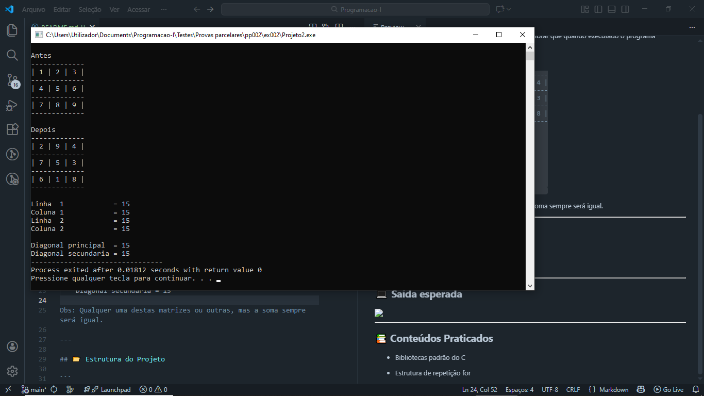

# 📘 Exercício 2

Usando a sua capacidade de análise, reflexão, reformulação e de exclusão faz um programa com uma estrutura que contém uma matriz de ordem 3 cuja soma dos números em todas as direções e sentidos na matriz seja igual a 15.

**Nota**: os números são de 1 a 9 são colocados na estrutura por si de acordo a sua preferência mais em repetição (ex: não poderá existir na matriz duas vezes o numero 8). Depois de colocados os números na estrutura realize e apresente no min seis(6) somas (lembrar que quando executado o programa apresentará o valor de 15 para a soma.)

**Saída**

    -------------    -------------    -------------
    | 8 | 1 | 6 |    | 6 | 7 | 2 |    | 2 | 9 | 4 |
    -------------    -------------    -------------
    | 3 | 5 | 7 |    | 1 | 5 | 9 |    | 7 | 5 | 3 |
    -------------    -------------    -------------
    | 4 | 9 | 2 |    | 8 | 3 | 4 |    | 6 | 1 | 8 |
    -------------    -------------    -------------
                                                   
    Linha  1            = 15                       
    Coluna 1            = 15                       
    Linha  2            = 15                       
    Coluna 2            = 15                       
                                                   
    Diagonal principal  = 15                       
    Diagonal secundaria = 15                       
                                                   
Obs: Qualquer uma destas matrizes ou outras, mas a soma sempre será igual.

---

## 📂 Estrutura do Projeto

```
ex002/ 
├── README.md 
└── main.c 
```
---

## 💻 Saída esperada

 

---

## 📚 Conteúdos Praticados

- Bibliotecas padrão do C

- Biblioteca time.h <br>
    (Gerar valores aleatórios)

- Biblioteca stdbool.h <br>
    (Trabalhar com variáveis booleanas)

- Estrutura de repetição for

- Manipulação de matrizes