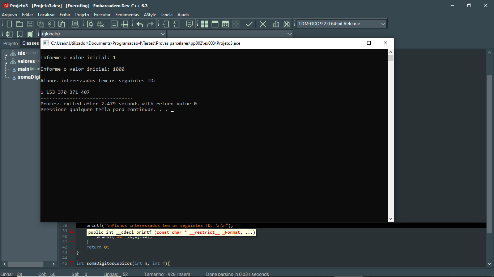

# 📘 Exercício 3

**DESAFIO TD - Gosto de programação**: este desafio consiste em identificar os estudantes interessados na programação num dado grupo de estudantes. Um estudante será considerado interessado em programação caso o seu número seja um número TD entende-se por TD quando a soma do cubo dos digitos individuais deste número é igual a ele mesmo, (ex: 153 é um número TD pois a soma dos cubos 1, 5, 3 é igual a 153).

Fazer um programa que dado o valor inicial e o valor final de um intervalo intervalo de números de matrícula calcula e apresenta os números TD e consequentemente dos alunos interessados (lembra que basta seu número de estudante ser TD é suficiente para o aluno ser considerado interesaado em programação).

**Nota**: o valor inicial e o final devem ser armazenados numa estrutura: criar uma nova estrutura e consequentemente um array de estrutura (tamanho 5) que armazenará cada número TD encontrado: Saída final apresentar todos os números TD armazenados no array da estrutura.

**Entrada**

    Valor inicial: 1
    Valor final:   1000

**Saída**

    Alunos interessados têm os seguintes TD: 
    1  153  370  371  407
---

## 📂 Estrutura do Projeto

```
ex003/ 
├── README.md 
└── main.c 
```
---

## 💻 Saída esperada

 

---

## 📚 Conteúdos Praticados

- Bibliotecas padrão do C

- Struct

- Manipulações de variavéis vetoriais do tipo estrutura

- Biblioteca math.h (pow)

- Estrutura de repetição for

- Cálculo da soma de digitos cúbicos com função recursiva