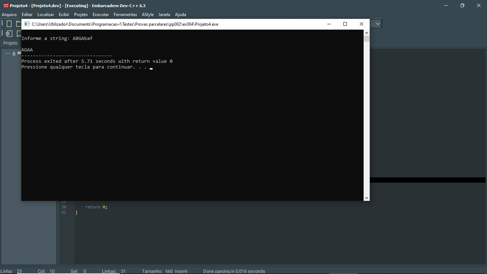

# 📘 Exercício 4

**Filtrar bases**: dada uma string, devolve uma string em maiuscúlas resultante da primeira filtragem de todos os caracteres que não representem uma das bases do ADN - A (adosina), T (timina), G (ganina) ,C (citosina):

**Entrada**

    ABGAbaf

**Saída**

    AGAA

---

## 📂 Estrutura do Projeto

```
ex004/ 
├── README.md 
└── main.c 
```
---

## 💻 Saída esperada

 

---

## 📚 Conteúdos Praticados

- Bibliotecas padrão do C

- Biblioteca string.h (strlen)

- Biblioteca ctype.h (tolower, toupper)

- Manipulação de strings

-Estrutura de repetição for