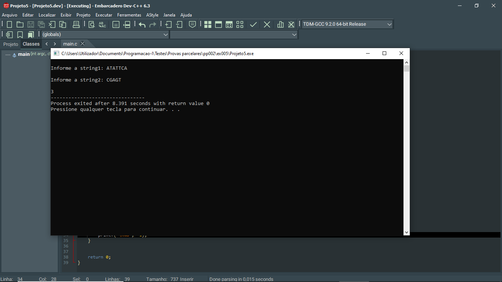
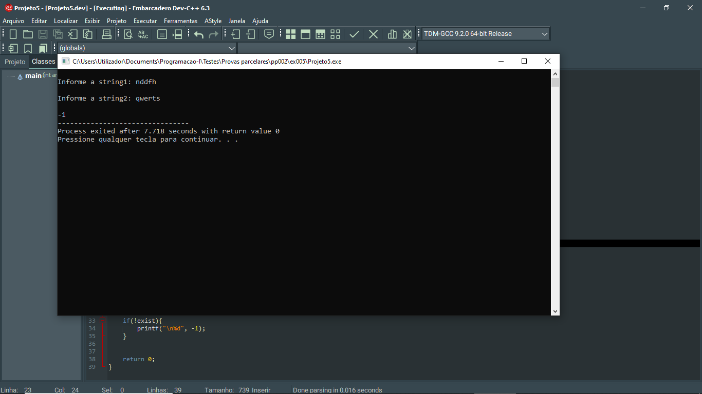

# 📘 Exercício 5

**Primeiro caracter em comum**: dadas duas strings, devolve um inteiro representando a posição do primeiro caracter comum: esta posição pode tornar valores que vão desde 1 até ao tamanho da menor string, no caso de haver um caracter em comum deverá devolver o valor e -1 se não houver caracter comum.

**Entrada**

    ATATTCA
    CGAGT

**Saída**

    3

---

## 📂 Estrutura do Projeto

```
ex005/ 
├── README.md 
└── main.c 
```
---

## 💻 Saída esperada

 
 <br>
 
---

## 📚 Conteúdos Praticados

- Bibliotecas padrão do C

- Bibliotecas string.h(strlen)

- Bibliotecas stdbool.h

- Manipulação de Strings

- Operador ternário

