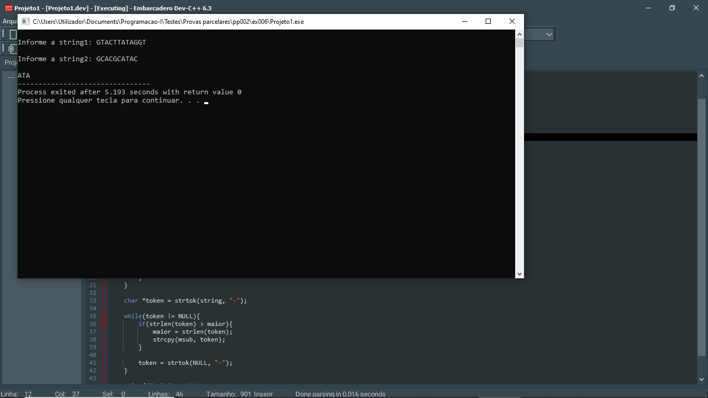

# 📘 Exercício 6

**Maior Substring comum**: dadas duas strings, devolve a string que constitui a maior substring comum em posições correspondentes entre as duas strings, se houver mais de uma substring comum com o tamanho máximo, retorna a primeira.

**Entrada**
    
    GTACTTATAGGT
    GCACGCATAC

**Saída** 

    ATA

---

## 📂 Estrutura do Projeto

```
ex006/ 
├── README.md 
└── main.c 
```
---

## 💻 Saída esperada

 
---

## 📚 Conteúdos Praticados

- Bibliotecas padrão do C

- Biblioteca string.h (strlen, strcpy, strtok)

- Operador ternário

- Manipulação de Strings

