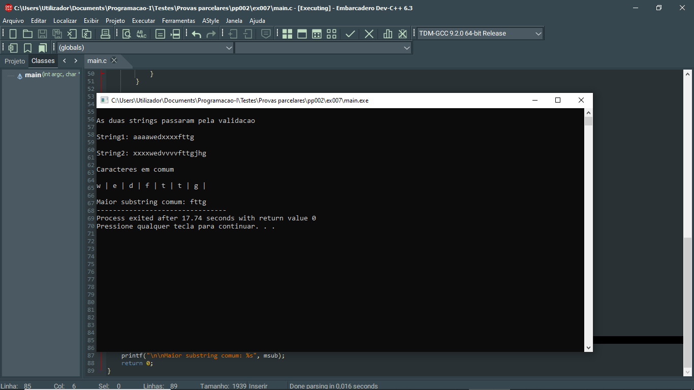
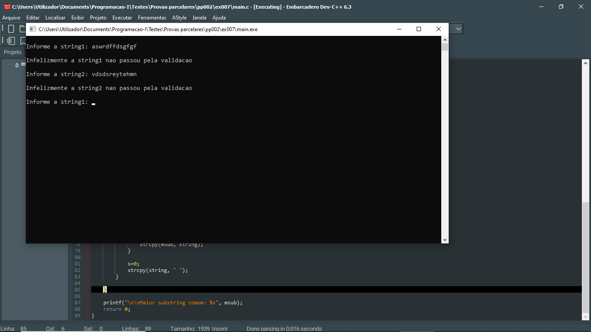

# 📘 Exercício 7

Na função main() faça:

1. Lê duas strings:

2. Filtrar as strings lidas;
3. Imprimir a maior string comum entre as duas strings;
4. Imprimir os caracteres que as duas strings têm em comum em posições iguais;
5. O programa termina quando for digitado qualquer string que contenha no final a letra g com o tamanho superior a 10;

---

## 📂 Estrutura do Projeto

```
ex007/ 
├── README.md 
└── main.c 
```
---

## 💻 Saída esperada

 
 <br>
 
 
---

## 📚 Conteúdos Praticados

- Bibliotecas padrão do C

- Biblioteca stdbool.h
(Variáveis booleanas para validar as strings)

- Bibilioteca string.h (strlen, strcpy)

- Manipulação de strings

- Operador ternário