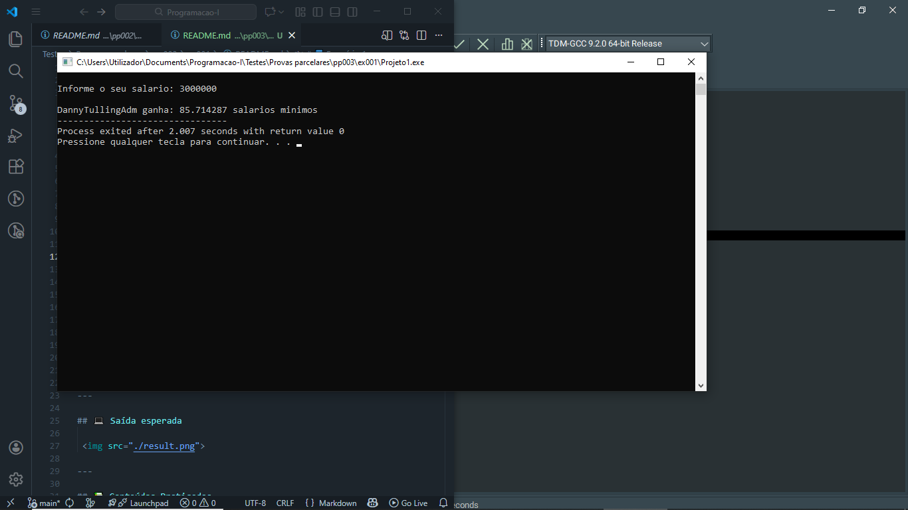

# 📘 Exercício 1

**A empresa XPTO Solutions**, pretende saber a quantidade de salaários mínimos ganhas pelo seu develpor <em>DannyTullingAdm</em>. Faça um programa que leia o salário  mínimo e o valor do salário do DannyTullingAdm. Calcule e apresente quantos salários mínimos que ele ganha.

**Entrada**

    Salário mínimo: 35,000
    Salário DannyTullingAdm: 3,000,000

**Saída**

    DannyTullingAdm ganha: 85.714286 sálarios mínimos

---

## 📂 Estrutura do Projeto

```
ex001/ 
├── README.md 
└── main.c 
```
---

## 💻 Saída esperada

 

---

## 📚 Conteúdos Praticados

- Bibliotecas padrão do C
