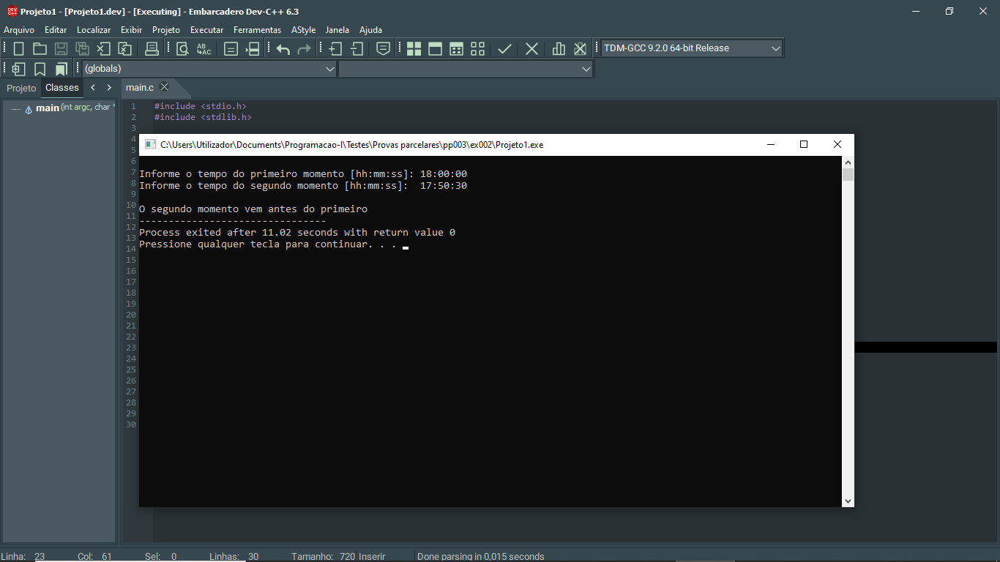

# 📘 Exercício 2

Escreva um programa em C que leia dois 'horários' de tempo em **hh:mm:ss** referentes a um momento cada e imprima uma das seguintes mensagens: 

- O primeiro momento vem antes do segundo
- O segundo momento vem antes do primeiro
- É o mesmo momento

**Entrada**

    Primeiro momento: 17:50:30
    Segundo momento:  18:00:00

**Saída**

    O primeiro momento vem antes do segundo

---

## 📂 Estrutura do Projeto

```
ex002/ 
├── README.md 
└── main.c 
```
---

## 💻 Saída esperada

 

---

## 📚 Conteúdos Praticados

- Bibliotecas padrão do C

- Estrutura de seleção (if else)

- Conversão do tempo em segundos
