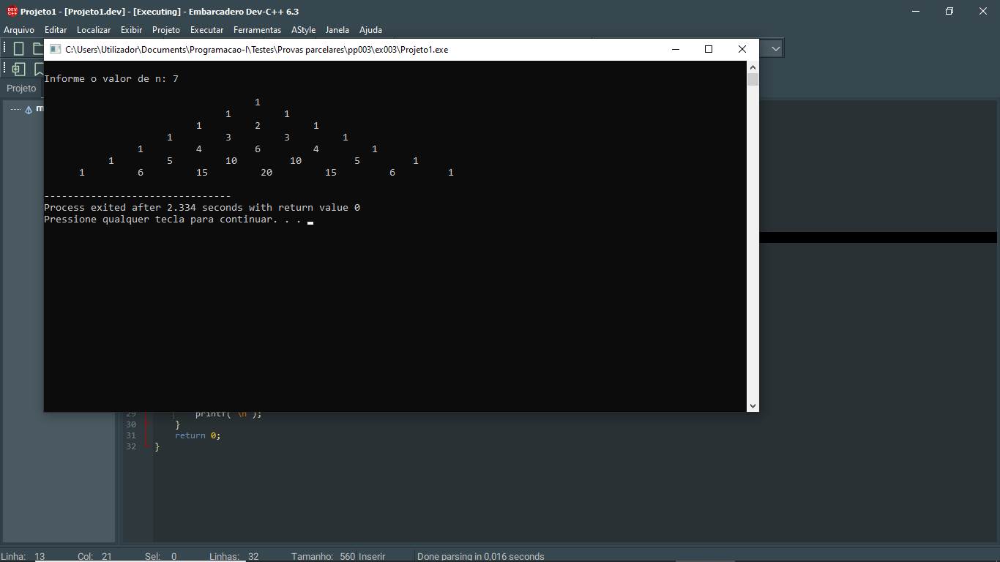

# 📘 Exercício 3

Elabore um programa que dado um número inteiro positivo qualquer imprima os números de acordo com o padrão mostrado nos exemplos abaixo: 

**Entrada**
    
    N: 5

**Saída**
    
                    1
    
                1       1
    
             1       2       1
    
        1       3       3       1
    
    1       4       6       4       1


OBS: o padrão depende do número digitado.

---

## 📂 Estrutura do Projeto

```
ex003/ 
├── README.md 
└── main.c 
```
---

## 💻 Saída esperada

 

---

## 📚 Conteúdos Praticados

- Bibliotecas padrão do C

- Estrutura de repetição (for)

