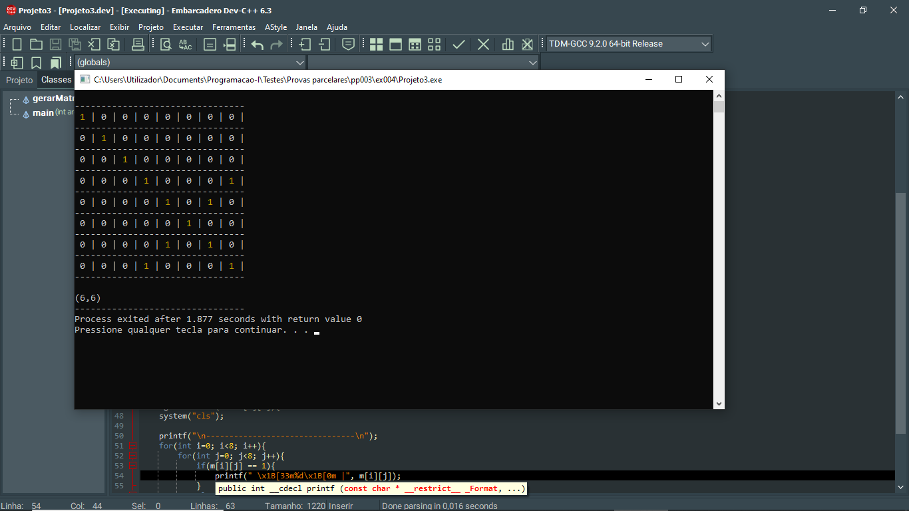
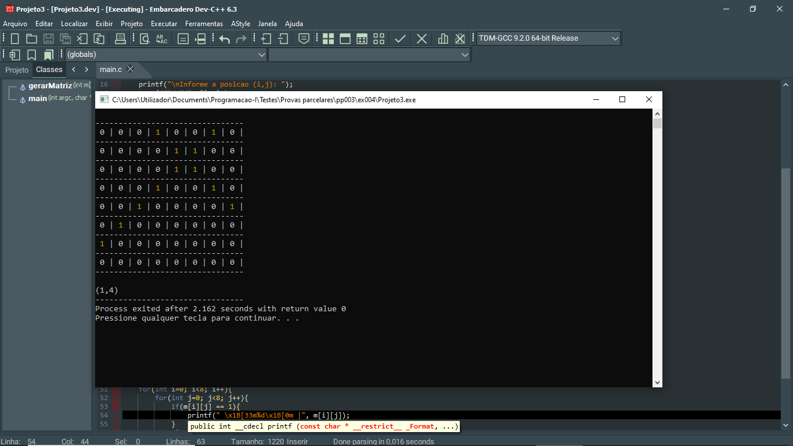

# 📘 Exercício 4

Escreva um programa em C que leia uma posição ( i , j ) de uma matriz 8X8, preenchido com zeros. A seguir marque todos os quadrados das duas diagonais que passam por esta posição colocando o valor 1 (um).

---

## 📂 Estrutura do Projeto

```
ex004/ 
├── README.md 
└── main.c 
```
---

## 💻 Saída esperada

 
 <br>
 

---

## 📚 Conteúdos Praticados

- Bibliotecas padrão do C

- Estrutura de repetição (for)

- Funções sem retorno       - Opcional

- Manipulação de cores em C - Opcional

