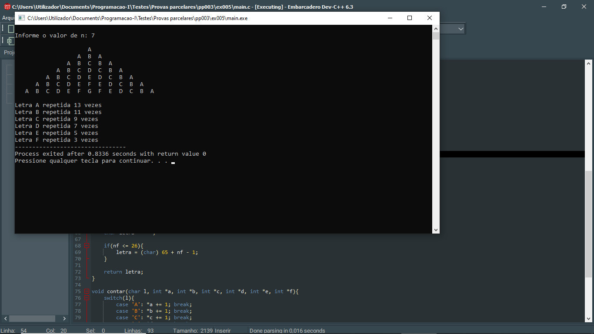
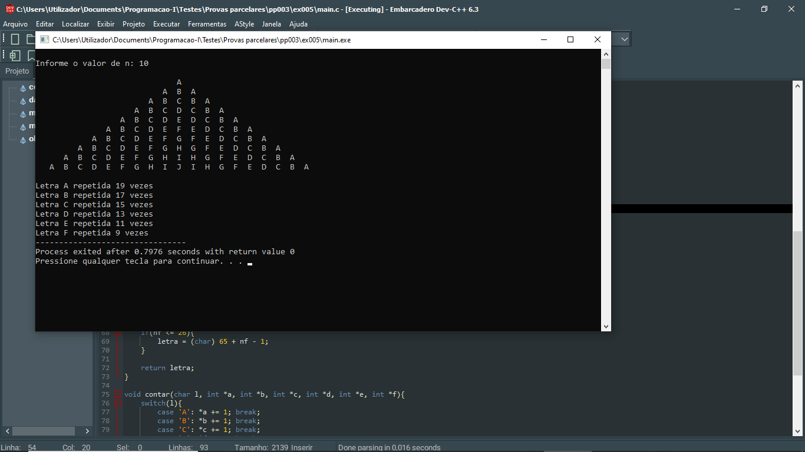

# 📘 Exercício 5

**DESAFIO DANNYTULLING - Chama e Repete**: este desafio consiste em apresentar o padrão **DANNYTULLING** para um sistema de chamadas e a quantidade de vezes que cada letra pode ser repetida no padrão. Para tal o programa recebe um inteiro não superior a 26 e apresenta o padrão **DANNYTULLING** e as respectivas repetições das letras (A até F) de acordo com o exemplo:

Notas:

- O programa tem uma função DannyTtulling (int n) do tipo char responsável pela criação do padrão DannyTulling de acordo com o parâmetro n e retorna 1.

- O programa tem dois procedimentos: o primeiro chamado contar (char letra) que conta as repetições de cada letra (A até F) no padrão e o seguinte procedimento MostrarRepetições() que apresenta no monitor a quantidade de vezes que cada letra repete no padrão.

- Usar variáveis globais ContA, ContB, ContC, ContD, ContE, ContF para contagem das repetições.

**Entrada**

    N: 4

**Saída**
                
                A
                
            A   B   A
            
        A   B   C   B   A
        
    A   B   C   D   C   B   A
    

    Letra A repetida 7 vezes
    Letra B repetida 5 vezes
    Letra C repetida 3 vezes
    Letra D repetida 1 vezes
    Letra E repetida 0 vezes
    Letra F repetida 0 vezes
---

## 📂 Estrutura do Projeto

```
ex005/ 
├── README.md 
└── main.c 
```
---

## 💻 Saída esperada

 
 <br>
 

---

## 📚 Conteúdos Praticados

- Bibliotecas padrão do C

- Estrutura de repetição (for)

- Funções e Procedimentos

- Manipulação de endereços de memória (Ponteiros)

