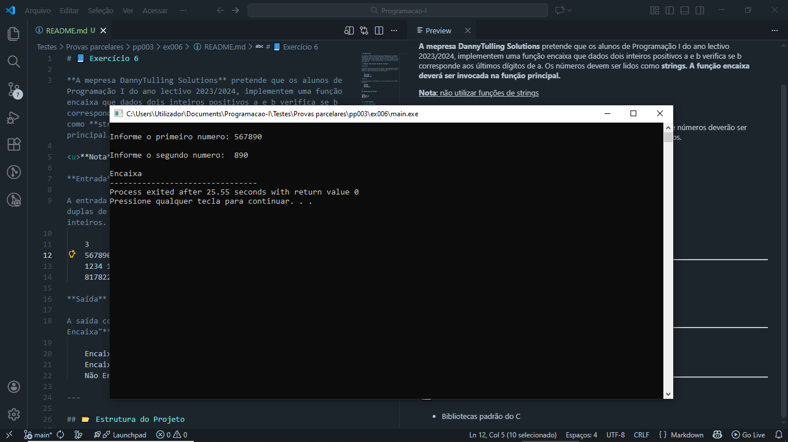
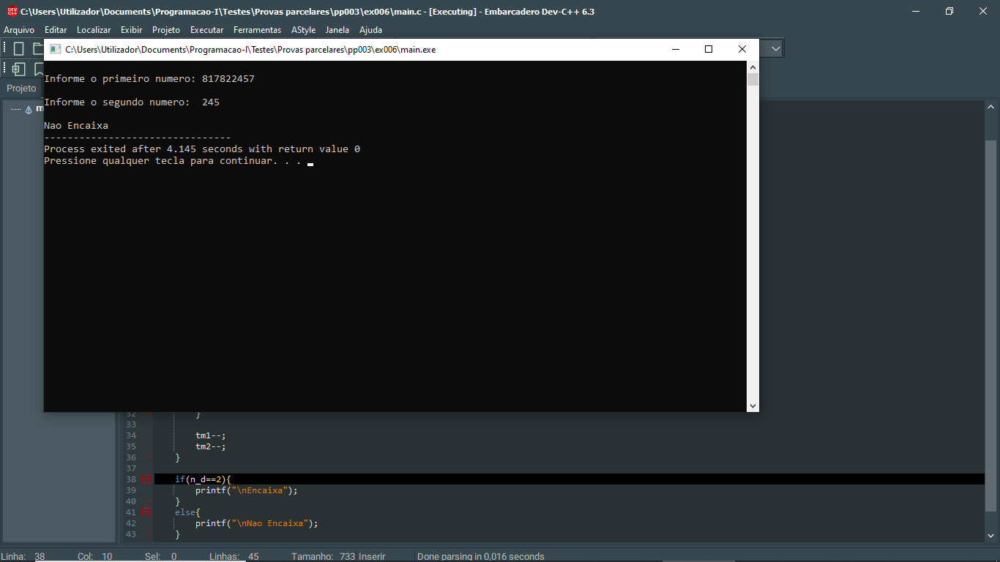

# 📘 Exercício 6

**A mepresa DannyTulling Solutions** pretende que os alunos de Programação I do ano lectivo 2023/2024, implementem uma função encaixa que dados dois inteiros positivos a e b verifica se b corresponde aos últimos dígitos de a. Os números devem ser lidos como **strings. A função encaixa deverá ser invocada na função principal.**

<u>**Nota**: não utilizar funções de strings</u>

**Entrada**

A entrada consiste de um número inteiro n que representa quantas duplas de números deverão ser analisadas, seguido de n números inteiros. Cada número possui até 100 dígitos.

    3
    567890 890
    1234 1234
    817822457 245

**Saída**

A saída consiste na impressão da frase **"Encaixa"** ou **"Não Encaixa"**

    Encaixa
    Encaixa
    Não Encaixa

---

## 📂 Estrutura do Projeto

```
ex006/ 
├── README.md 
└── main.c 
```
---

## 💻 Saída esperada

 
 <br>
 

---

## 📚 Conteúdos Praticados

- Bibliotecas padrão do C

