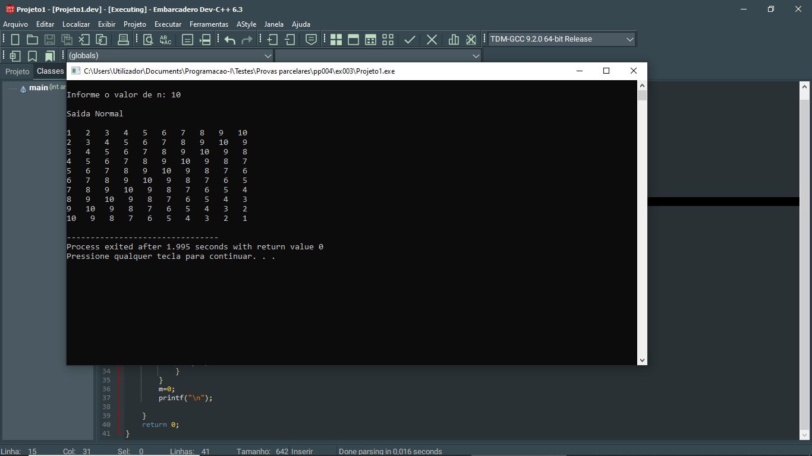

# 📘 Exercício 3

DESAFIO TULLINGORA: Tullingora é o desafio Papoite Tulling Organiza e Gira que consiste em dado um valo **N**, cria-se uma matriz NXN e gera-se o padrão dos números quadrados armazenando-os na respectiva matriz, ao final apresenta-se a matriz preenchida de forma normal e espiral partindo do primeiro elemento até ao último elemento da espiral.

**Nota**: o programa lê somente o valor de **N**.

**Entrada** 

    N: 5

**Saída normal**
    
    1   2   3   4   5
    2   3   4   5   4
    3   4   5   4   3
    4   5   4   3   2
    5   4   3   2   1

**Saída espiral**

    1234543212345432345434545

---
## 📂 Estrutura do Projeto

```
ex003/ 
├── README.md 
└── main.c 
```
---

## 💻 Saída esperada

 

---

## 📚 Conteúdos Praticados

- Bibliotecas padrão do C

- Manipulação de vetores
