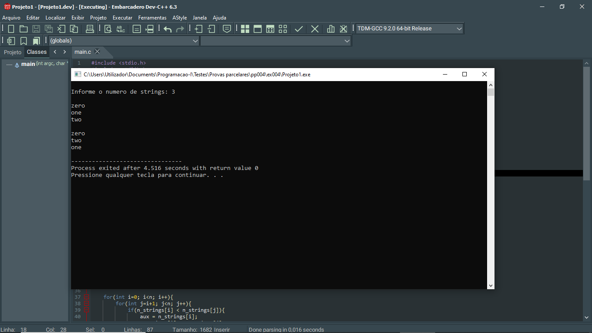
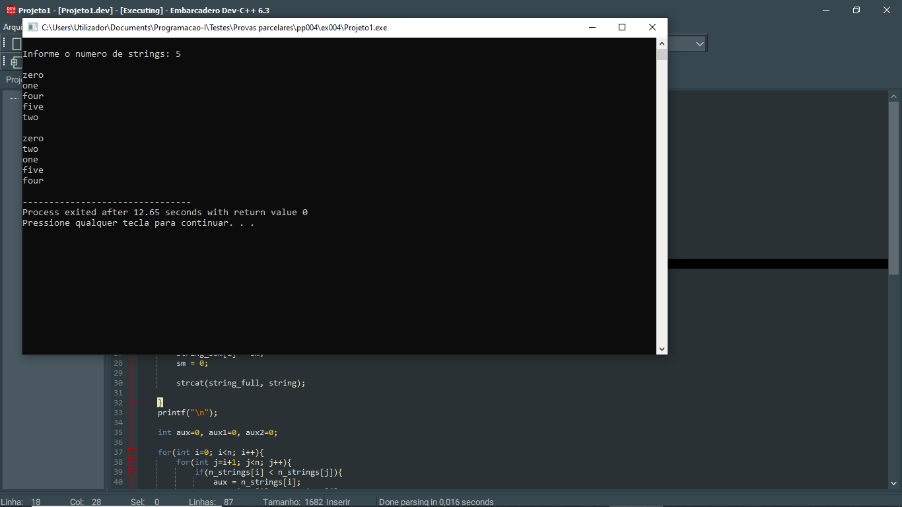

# 📘 Exercício 4

**Troca descendente**: escreva um programa que dado a quantidade de strings e as respectivas strings, apresenta-as na mesma ordem de **Z** para **A** conforme as suas primeiras letras (ordem descendente).

**Entrada**

Quantidade de strings: 3

Strings: 

**Zero** **One** **Two**

**Saída**

Zero Two One

---
## 📂 Estrutura do Projeto

```
ex004/ 
├── README.md 
└── main.c 
```
---

## 💻 Saída esperada

 
 <br>
 

---

## 📚 Conteúdos Praticados

- Bibliotecas padrão do C

- Biblioteca string.h (strcat, strlen)

- Manipulação de strings