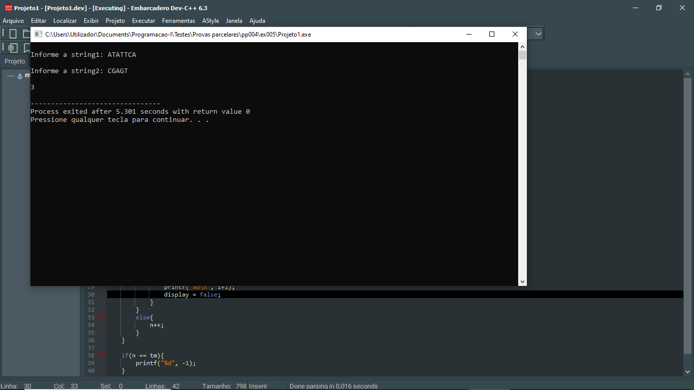

# 📘 Exercício 5

**PrimeiroCaracterComum**: dadas duas strings, devolve um inteiro representando a posição do primeiro caracter comum: esta posição pode tomar valores que vão desde 1 até o tamanho da menor string das duas strings no caso de haver correspondência, deverá devolver o valor -1 caso não haja.

**Entrada**

ATATTCA

CGAGT

**Saída**

3

---
## 📂 Estrutura do Projeto

```
ex005/ 
├── README.md 
└── main.c 
```
---

## 💻 Saída esperada

 

---

## 📚 Conteúdos Praticados

- Bibliotecas padrão do C

- Biblioteca string.h (strlen)

- Biblioteca stdbool.h

- Manipulação de strings

- Operador ternário