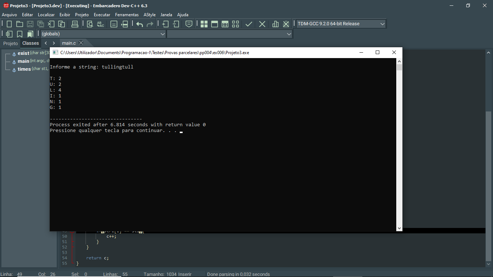

# 📘 Exercício 6

Dada uma string, fazer um programa que apresente a string e a quantidade de vezes que a mesma é repetida

**Entrada**

Tullingtull

**Saída**

T: 2 <br>
U: 2 <br>
L: 4 <br>
I: 1 <br>
N: 1 <br>
G: 1

---
## 📂 Estrutura do Projeto

```
ex006/ 
├── README.md 
└── main.c 
```
---

## 💻 Saída esperada

 

---

## 📚 Conteúdos Praticados

- Bibliotecas padrão do C