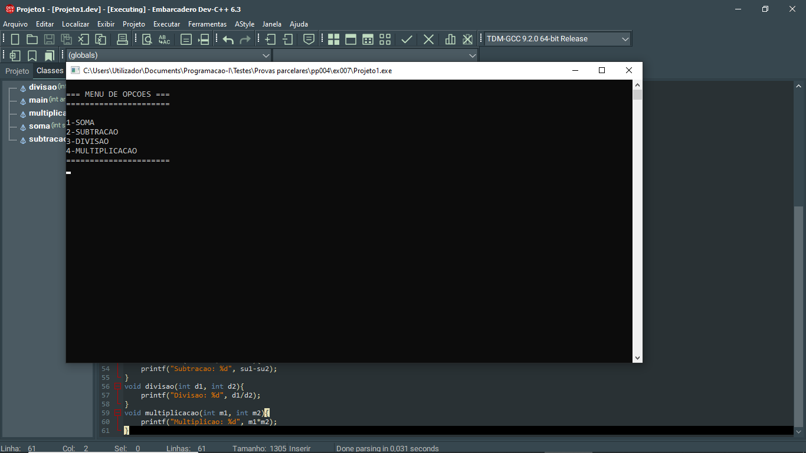
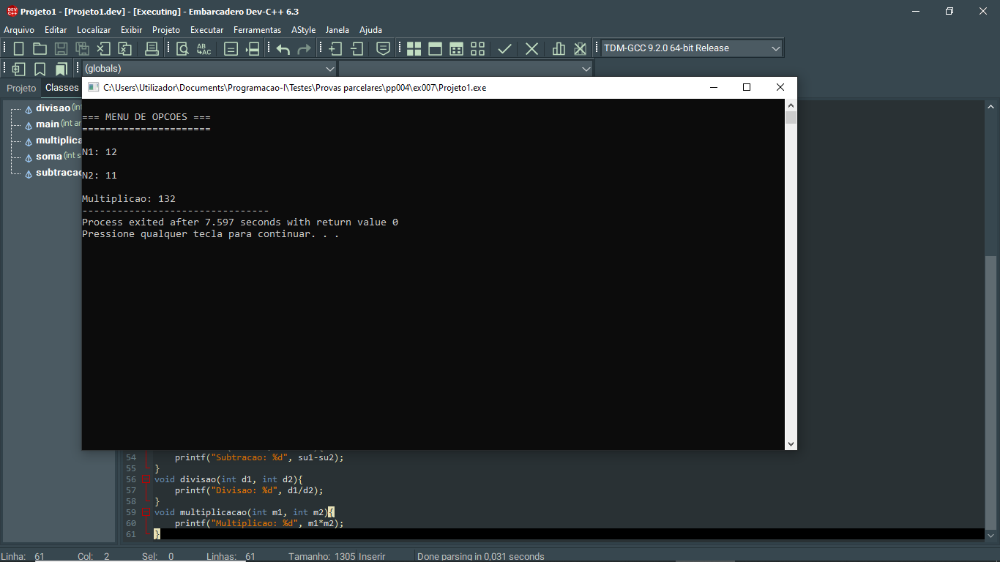

# 📘 Exercício 7

Na função main(), crie o menu de opções e chame os métodos criados.

---
## 📂 Estrutura do Projeto

```
ex007/ 
├── README.md 
└── main.c 
```
---

## 💻 Saída esperada

 
 <br>
 

---

## 📚 Conteúdos Praticados

- Bibliotecas padrão do C

- Estrutura swicth